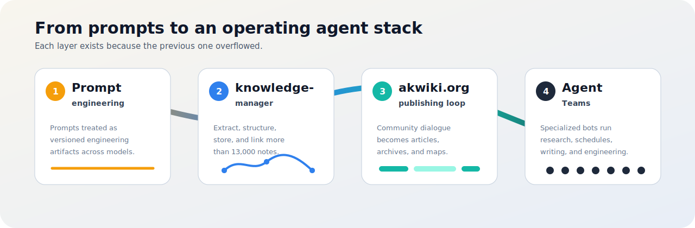

  

# treylom / tofukyung

I build prompt systems, knowledge pipelines, public wiki workflows, and agent teams that run in production.

프롬프트 시스템, 지식관리 파이프라인, 공개 위키 자동화, 그리고 운영되는 에이전트 팀을 만듭니다.

  

---

## The Path

It started with prompt engineering — treating prompts as a real engineering artifact, iterating one workflow through dozens of revisions until it consistently produced usable output across models. That discipline generated volume: prompts, research notes, drafts — thousands of markdown files that a folder tree couldn't hold anymore. So I built a knowledge pipeline — extract, structure, store, link — and open-sourced it as knowledge-manager; my Obsidian vault grew past 13,000 interlinked notes.

But a private knowledge base only compounds if it's used, so the next step was publishing: an automated wiki (akwiki.org) where community conversations become fact-checked articles, searchable archives, and keyword network maps — refreshed daily without manual editing. Running that publishing loop every day is more work than one person or one AI session can do, which is where agent teams came in: a team of specialized bots — research, scheduling, writing, engineering — each anchored to its own folder of the vault, coordinating over Discord, running around the clock.

Each layer exists because the previous one overflowed — prompts created knowledge, knowledge demanded structure, structure was worth publishing, and publishing required a team. The whole stack has been in continuous production for over six months. Along the way it turned into teachable, installable material: two distribution bundles (ThisCode, ThisCodex) and a hands-on Claude Code/Codex course built for a real lecture series. This profile is the logbook of that path.

## 발전 경로

시작은 프롬프트 엔지니어링이었다 — 프롬프트를 제대로 된 공학 산출물로 다루면서 하나의 워크플로우를 수십 번 개정했다. 그 습관이 수천 개의 마크다운 노트를 만들어냈고, 폴더 정리로는 감당이 안 돼 추출→구조화→저장→연결 지식관리 파이프라인(knowledge-manager, 오픈소스)을 만들었다 — 옵시디언 vault는 13,000개 이상의 연결된 노트로 자랐다. 쌓인 지식은 써먹어야 복리가 되기에 다음은 발행이었다 — 커뮤니티 대화가 매일 자동으로 검증된 기사·아카이브·키워드 지도가 되는 위키(akwiki.org). 이 발행 루프를 매일 돌리는 건 한 사람·한 세션으로는 불가능해서, vault 폴더 하나씩을 작업 공간으로 삼은 전문 봇 팀(리서치·일정·글쓰기·엔지니어링)이 Discord로 협업하며 24시간 돌아가게 했다. 앞 단계가 넘쳐서 다음 단계가 필요해진 경로이고, 전체 스택은 6개월 이상 실운영 중이다. 그 과정 자체가 가르칠 수 있는 자산이 되어 배포판 2종(ThisCode·ThisCodex)과 실강의(Claude Code/Codex 과정)로 이어졌다. 이 프로필은 그 길의 기록이다.

---

## 🤖 The Agent Team

The publishing loop runs on a team of specialized bots, each anchored to its own folder of the vault and coordinating over Discord — around the clock.
발행 루프는 vault 폴더 하나씩을 맡은 전문 봇 팀이 Discord로 협업하며 24시간 돌립니다.

| Bot | Role |
|---|---|
| 🎛️ **Karpathy** | Orchestration & policy — coordinates the team and holds the workflow gates |
| 🔍 **Konan** | Research & fact-checking — cross-verified sourcing, contradiction detection |
| 📅 **Strange** | Schedule & tasks — calendar, todos, watchdog liveness |
| ✍️ **Geuljaegyeong** | Writing — Threads, essays, long-form drafts |
| 🎨 **Sonseokhee** | Image generation & code build — Codex-side engineering |
| 🐣 **AK-Tofu** | Daily community-insight pipeline — collect → summarize → publish |

---

## Timeline

  

---

## Projects

| Project | What it is |
|---|---|
| [tofable](https://github.com/treylom/tofable) | Transfers a strong model's working style into a harness: rules, verification gates, and benchmarks. |
| [knowledge-manager](https://github.com/treylom/knowledge-manager) | Extract, structure, store, and link web/PDF/social content into an Obsidian or Notion knowledge base. |
| [ThisCode](https://github.com/treylom/ThisCode) / [ThisCodex](https://github.com/treylom/ThisCodex) | Distribution bundles for Claude Code, Codex, Discord bot operations, and rules-system patterns. |
| [prompt-engineering-skills](https://github.com/treylom/prompt-engineering-skills) | Prompt engineering skill library for model-specific workflows and image/video generation patterns. |
| [lesson-cc-codex](https://github.com/treylom/lesson-cc-codex) | Interactive Claude Code + Codex lesson engine for a hands-on lecture series. |

---

## Current Stack

- **Prompt engineering**: prompts treated as versioned engineering artifacts.
- **Knowledge management**: Obsidian-centered extract, structure, store, and link pipeline.
- **Publishing**: akwiki.org, daily community articles, searchable archives, and network maps.
- **Agent teams**: specialized Discord-coordinated bots for research, schedule, writing, and engineering work.
- **Teaching**: installable bundles and hands-on Claude Code/Codex course material.

---

  <picture>
    <source media="(prefers-color-scheme: dark)" srcset="https://raw.githubusercontent.com/treylom/treylom/output/github-snake-dark.svg" />
    <source media="(prefers-color-scheme: light)" srcset="https://raw.githubusercontent.com/treylom/treylom/output/github-snake.svg" />
    
  </picture>

